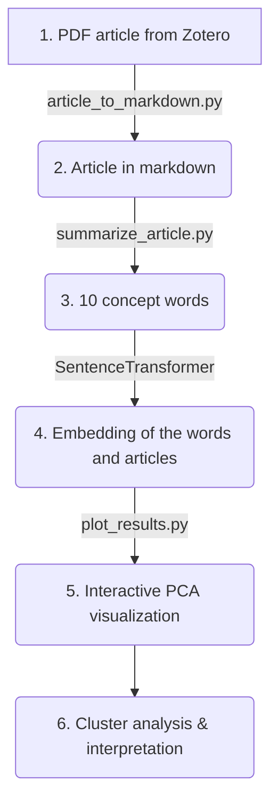
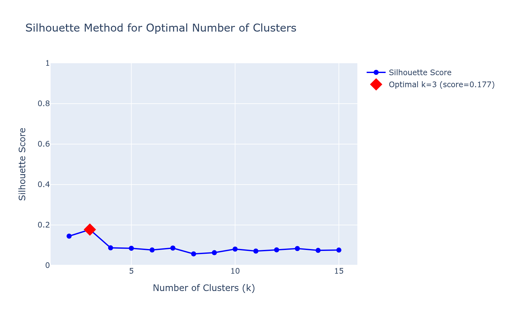
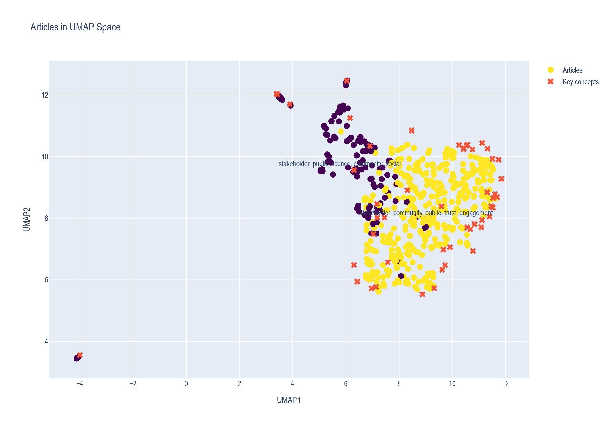
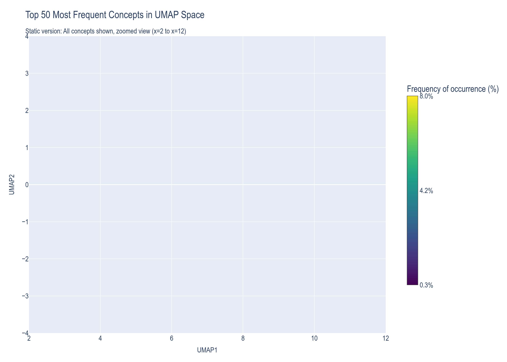

# AI-social-science

This is the repository for AI and social science: how can we use AI for analyzing corpus of scientific litterature.

The flowchart below describes the steps we have followed. The sections of the **README** describe the steps more in depth.



## 1. PDF article from Zotero

After suggesting a search string, we start the search in Scopus and Google Scholar and extract the most relevant articles. In total, we found a gathered a corpus of about 742 articles. The results are stored in Zotero. Using Zotero extract function, we pull the PDF of the articles. Because the Zotero extract function was not able to extract all PDFs, we manually extracted the remaining PDFs.

## 2. Article in markdown

PDF is made for humans, but not so much for machines as it is not possible to parse raw PDFs for analysis. Before inputting the text into a LLM, we transformed the PDF into a markdown file, a machine readable format that a LLM can parse. For this we use the script `articles_to_markdown.py` which queries a deep learning vision model that takes the pages of the PDF as input and output its text as a markdown document. We use `Gemini 2.0-flash` because of its speed and low cost.

## 3. Conceptually summarising the articles

Now that the text is machine readable, we input the markdown article to an LLM and ask it to summarize the article in 10 conceptual words related to social acceptance. The summary is a python list that is saved as a .csv for the next step.

The prompt is as follow:

```
    prompt = f"""Read the text. Identify the concepts that appear in the semantic neighbourhood of the idea of “social acceptance” and
    its close synonyms (public acceptance, community acceptance, societal acceptance, stakeholder acceptance, licence to operate, social licence).
        - Use only single words.
        - Output a Python list of 0–10 lowercase words.
        - Include only concepts that relate to how the article uses, defines, or implies social acceptance.
        - Ignore concepts unrelated to social acceptance.
        - If the text contains no content related to social acceptance or its close synonyms, output an empty list [] and do not infer or guess.
        - Only output words that occur explicitly in the text or are directly implied by its discussion of acceptance.
        - Do not add speculative concepts.

    Here is the article: \n\n{article}"""
```

We intentionally excluded broader evaluative terms such as "support" and "approval," since they are not strict synonyms for social acceptance and would probably introduce unwanted noise into the analysis. Moreoever, to not force the LLM to output meaningless term, we explicitely ask the model to output an empty list if the text does not contain any content related to social acceptance. This way, outlier articles are given empty lists that we can filter out later in the analysis. We also ask the LLM to return a `python list`, as this can directly used for analysis. For each article, the pipeline outputs a `.csv` file of the form:

|Article | Content |
|--------|---------|
| article1 | "['stakeholder', 'public', 'community']" |


## 4. Words to numerical concepts

For each word of the list of concepts of the articles we generate an embedding. An embedding is a numerical representation of a word, representation that is suitable for analysis. The word is thus represented as a high-dimension vector of numbers which capture relationships between itself and other words. In particular, words which appear in similar contexts are mapped to vectors which are nearby. For example the vectors for *walk* and *run* are nearby, but the vectors for *grass* and *star* are far away from each others.

Once each words have been transformed into embeddings, we take the average value so that we capture an "average embedding" of the article, translating into an "average concept".

## 5. UMAP plot

We plot the vectors of each article in a 2D plot using a **UMAP**. We group the vectors into clusters using the **Silhouette method**, which assigns a silhouette score to the cluster space. The silhouette score measures the quality of clustering and ranges from -1 to 1, with 1 being a perfect clustering (i.e. well-separated clusters) and -1 poor clustering (i.e. wrong cluster assignements).

To determine the optimal number of cluster we test K-means clustering with k ranging from 2 to 15 clusters. For each k, we compute the average silhouette score across all articles and finally, we choose the number of clusters that maximises the silhouette score.

## Results and interpretation

In total, out of the 742 article, only 508 had a valid output based on our prompt.

Results from the **Silhouette method** show that in our case the optimal number of clusters is **3** (i.e. the number of cluster k maximizing the silhouette score of 0.17).



The plot below shows articles clustered in a 2D PCA space based on their conceptual similarity:



**📊 [Interactive version of the plot](./assets/articles_umap_plot.html)**

We also plotted the concepts words represented in the articles along with their frequencies. We plotted only the 50 words occuring the most often in the corpus.



**📊 [Interactive version of the plot](./assets/articles_umap_plot_concepts_only.html)**
