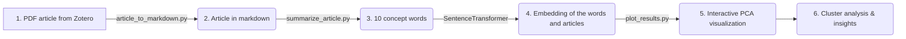

# AI-social-science

This is the repository for AI and social science: how can AI help social scientists in the litterature review process.

The steps are described below:



## 1. PDF article from Zotero

After suggesting a search string, we start the search in Scopus and Google Scholar and extract the most relevant articles. In total, we found a gathered a corpus of about 742 articles. The results are stored in Zotero. Using Zotero extract function, we pull the PDF of the articles. Because the Zotero extract function was not able to extract all PDFs, we manually extracted the  

**_NOTE_**: Not all PDFs are found and there may be a need for manually extracting the articles.

## 2. Article in markdown

PDF is made for humans, but not so much for machines. Before inputting the text into a LLM, we need to turn the PDF into a markdown file, a machine readable format that a LLM can parse. For this we use the script `articles_to_markdown.py` which queries a deep learning vision model that takes the pages of the PDF as input and output its text as a markdown document. We use Gemini 2.0-flash because of its speed and low cost.

**_NOTE_**: Here we are using gpt-4o-mini 

## 3. 10 words summary

Now that the text is machine readable, we input the markdown article to an LLM and ask it to summarize the article in 10 conceptual words. The summary is a python list that is saved as a .csv for the next step.

The prompt is as follow:

```
    prompt = f"""Read the text. Identify the ten most essential conceptual terms
    that capture the core ideas of the article.

    - Use single words only (no phrases).
    - Pick concepts, not summaries or opinions.
    - Output a valid python list of exactly ten lowercase words.
    - Do not repeat near-synonyms
    - Output the python list only, no explanation, reasoning or additional text.

    Here is the article: \n\n{article}"""
```

We intentionally excluded broader evaluative terms such as "support" and "approval," since they are not strict synonyms for social acceptance and would probably introduce unwanted noise into the analysis


## 4. Words to numerical concepts

For each word of the list of concepts of the articles we generate an embedding. An embedding is a numerical representation of a word, representation that is suitable for analysis. The word is thus represented as a high-dimension vector of numbers which capture relationships between itself and other words. In particular, words which appear in similar contexts are mapped to vectors which are nearby. For example the vectors for *walk* and *run* are nearby, but the vectors for *grass* and *star* are far away from each others.

Once each words have been transformed into embeddings, we take the average value so that we capture an "average embedding" of the article, translating into an "average concept".


### 5. PCA plot

Finally, we use an embedding model to turn the list of 10 words into a single vector. This vector is a numerical representation of the concepts found in the article. We plot the vectors of each article in a 2D plot using a PCA.

#### Interactive Visualization

The plot below shows articles clustered in a 2D PCA space based on their conceptual similarity:


**📊 [View Interactive Plot](articles_pca_plot.html)** - Click to explore the interactive version with hover details, zoom, and concept overlays.

**Key Features:**
- **Clusters**: Articles are grouped into 3 clusters based on conceptual similarity
- **Axis Interpretation**: 
  - PC1 (horizontal): Ranges from technical CCS/storage concepts (left) to public acceptance/policy concepts (right)
  - PC2 (vertical): Spans from ecosystem services/governance (bottom) to technical CO2/hydrogen storage (top)
- **Cluster Themes**:
  - **Cluster 0** (Blue): CCS, acceptance, risk, policy, perception
  - **Cluster 1** (Red): Storage, carbon, CCS, capture, policy  
  - **Cluster 2** (Green): Carbon, ecosystem, biodiversity, management, services

#### Generating the Plot

To regenerate the visualization with your own data:

```bash
# Using the silhouette method to automatically determine optimal clusters
uv run python src/plot_results.py --summary_dir your_summary_directory

# Or specify a fixed number of clusters
uv run python src/plot_results.py --summary_dir your_summary_directory --n_clusters 3
```

The script will generate both an interactive HTML file and a static PNG image for embedding in documentation.